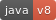
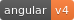

[]()  []() []()

### Senepe
Senepe (Tswana language - translated a photo) is a photo sharing Web application. It allows the user to browse through a list of photos upon landing on the site. 
In the case the user wishes to share photos, the user can register and login to do so. The aim of this project is to demonstrate Angular fundamentals as well as good programming standards. 
The back-end is developed in Spring boot and front-end is Angular 4. 

### Requirements
1. Internet connection
2. Editor (WebStorm/Visual Studio Code) - ensure Editor is correctly configured to avoid linting issues.
3. Angular CLI should be installed (https://cli.angular.io)
4. NodeJS/npm should be installed (https://nodejs.org)
5. Knowledge of Terminal or CMD usage

### Setup

- ```$ git clone https://github.com/mrmodise/senepe.git```
- ``$ yarn install`` to install dependencies. 

The project was generated using ``angular CLI``, as such, providing ``$ ng serve -o`` should compile the project and open ln.

### State Management
Although this is an overkill for such a small application ``:)``, state is managed with Redux (https://github.com/angular-redux/store). Currently, this is a Work-in-progress (WIP).

### Unit Tests
```$ ng test``` to execute all unit tests. Currently all 70+ tests should execute.

Am busy finishing off the unit tests for all components and services. So far, these are "completed":

- LoginComponent
- RegisterComponent
- AddPhotoComponent
- PhotoListComponent
- AppComponent
- LoginService
- PhotoService

### End-to-end Tests
To execute e2e tests: ```$ ng e2e```. WIP

### Docker & Kubernetes
To build the Docker image for this app, first build the project ``($ yarn build)`` then image via ``$ docker build -t senepe:1.0 .`` and then ``$ docker run senepe:1.0``.
 I have already built an image, available at 
  https://hub.docker.com/r/mrmodise/senepe/ so you can ``$ docker pull mrmodise/senepe:latest`` and for backend ``$ docker pull mrmodise/backend:1.0``. If you are using Kubernetes to orchestrate your containers' architecture, follow the following commands:
  
* ``$ minikube dashboard`` 
* ``$ kubectl create -f backend.yaml`` 
* ``$ kubectl create -f front.yaml`` 
* ``$ minikube service senepe-backend-service`` 
* ``$ minikube service senepe-front-service`` 
  
More information on the Docker image for this project: https://hub.docker.com/r/mrmodise/senepe/

### Documentation
Documentation for this project has been generated using @Compodoc. This is available under the `documentation` folder. Very useful for understanding the code base.

### Summary 

`$ ng serve -o` for a dev server. App will open at `http://localhost:4200/`. 

For back-end code `$ cd backend` and `$ mvn package` to package the back-end code. ``$ java -jar target/senepe-0.0.1-SNAPSHOT.jar`` to execute the back-end code. REST API launches on port 8088. All routes are secured excluding `/auth`

Completed modules: `registration`, `photo listing`, `login` and `photo uploading`.

`Note` project is still under development. Updated weekly

More refactoring to be done.....

### License
```
The MIT License (MIT)

Copyright (c) 2016 Mr Mod

Permission is hereby granted, free of charge, to any person obtaining a copy
of this software and associated documentation files (the "Software"), to deal
in the Software without restriction, including without limitation the rights
to use, copy, modify, merge, publish, distribute, sublicense, and/or sell
copies of the Software, and to permit persons to whom the Software is
furnished to do so, subject to the following conditions:

The above copyright notice and this permission notice shall be included in all
copies or substantial portions of the Software.

THE SOFTWARE IS PROVIDED "AS IS", WITHOUT WARRANTY OF ANY KIND, EXPRESS OR
IMPLIED, INCLUDING BUT NOT LIMITED TO THE WARRANTIES OF MERCHANTABILITY,
FITNESS FOR A PARTICULAR PURPOSE AND NONINFRINGEMENT. IN NO EVENT SHALL THE
AUTHORS OR COPYRIGHT HOLDERS BE LIABLE FOR ANY CLAIM, DAMAGES OR OTHER
LIABILITY, WHETHER IN AN ACTION OF CONTRACT, TORT OR OTHERWISE, ARISING FROM,
OUT OF OR IN CONNECTION WITH THE SOFTWARE OR THE USE OR OTHER DEALINGS IN THE
SOFTWARE.

```
